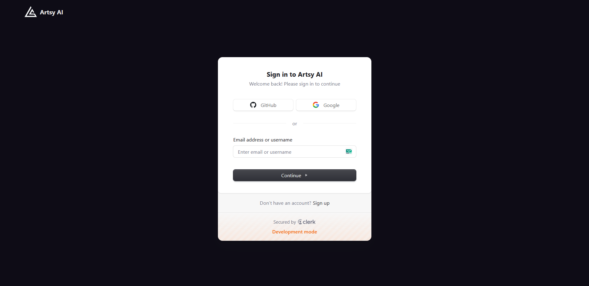

# 🖼️ Artsy AI

**Artsy AI** is an intelligent chatbot powered by the **Gemini API** that can analyze an uploaded image and **predict its art style** and suggest you art style based on your interest. It also functions like ChatGPT for general text-based queries. Built with the **MERN stack**, it uses **Clerk** for user authentication and **ImageKit** for image storage.

---

## ✨ Features

- 🎨 Art style prediction from uploaded images
- 💬 Chat-like responses using Gemini API
- 📂 Image uploads only (no file or document upload)
- 🔐 User authentication via Clerk
- ☁️ Image hosting with ImageKit
- ⚙️ Built with MERN stack (MongoDB, Express, React, Node.js)

---

## 🛠️ Tech Stack

| Category       | Tech                    |
|----------------|-------------------------|
| Frontend       | React (Vite) |
| Backend        | Node.js, Express        |
| Database       | MongoDB (Atlas)         |
| AI/LLM         | Gemini API (Google)     |
| Auth           | Clerk                   |
| Image Hosting  | ImageKit                |

---

## 🖼️ Screenshots


### 🔍 Home Page


### 💬 Chat Functionality


### 🖼️ Art Style Prediction


### Sign Up/In Page




# ⚙️ Artsy AI — Project Setup Guide

Welcome! This guide will help you set up **Artsy AI**, a MERN-based chatbot.


---

## ✅ Requirements

Ensure the following are installed and configured:

- **Node.js** (v18+)
- **npm** or **yarn**
- **MongoDB Atlas** account
- **Gemini API key** (Google)
- **Clerk** account (for user authentication)
- **ImageKit** account (for image storage)

---

## 🔧 Step-by-Step Setup

### 1. Clone the Repository

```bash
git clone https://github.com/Abhishek-Verma0/Artsy-AI.git
```
### 2. Navigate to Client Directory and install dependencies

```bash
cd client
npm install  # installs all required dependencies
npm run dev  # it starts the frontend server at localhost
```

### 3. Navigate to backend directory and install dependencies
```bash
cd backend 
npm install # installs all required dependencies
npm start  # it starts the backend server 
```
### 4. Create .env file in both frontend and backend to store the required API keys and credentials or urls

#### For backend .env required var
- IMAGE_KIT_ENDPOINT= 
- IMAGE_KIT_PUBLIC_KEY=  
- IMAGE_KIT_PRIVATE_KEY=  


- MONGO = 

- CLERK_SECRET_KEY=  

- CLERK_PUBLISHABLE_KEY= 


- CLIENT_URL= http://localhost:5173

#### For client .env required var

- VITE_IMAGE_KIT_ENDPOINT= 
- VITE_IMAGE_KIT_PUBLIC_KEY=  
- VITE_CLERK_PUBLISHABLE_KEY= 
- VITE_GEMINI_PUBLIC_KEY =
-VITE_API_URL = http://localhost:3000


# 🤝 Contributing to Artsy AI

Thanks for your interest in contributing to **Artsy AI**! 🎨 
We welcome all kinds of contributions—bug fixes, new features, performance improvements, documentation, and suggestions.

---


